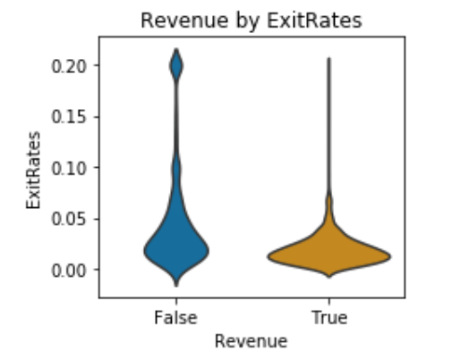

# Predicting E-Commerce Customer Behavior

## Background 
Every day there are more and more companies selling their products online versus in brick-and-mortar stores.  These companies collect data on their customers' behavior purchasing products and services online.  This data is very valuable to companies.  They analyze this data to acquire insights on their customers' buying behavior patterns.  The analysis will provide leverage to the company by creating new strategies to market customers.  In this project, I will use e-commerce data provided by a company in Turkey to predict the buying patterns of customers.  

## Objective
I will use machine learning to create a predictive model.  This model will use customers' attributes to predict whether a visitor/customer will make a purchase or not.  This model can be used for a e-commerce website to trigger a recommendation system to provide a visitor product recommendation based on the model's prediction this visitor will purchase something.

## Dataset
The dataset comes from a Turkey e-commerce company www.gozalangroup.com.tr/.  I extracted the data from https://www.kaggle.com/roshansharma/online-shoppers-intention named Online Shopper's Intention.

The dataset consists of 12,330 customer sessions (rows), 10 numerical and 8 categorical variables (columns). I will use ‘Revenue’ (True or False) variable as my target variable. The other 17 variables will be my predictor variables, customer's attributes, or features. I will engineer more attributes before modeling. This dataset was formed in a one-year period not including holidays, special days, or specific campaigns. The size of the data set is adequate for the data science tasks I plan on performing on it.

## Research Questions
- What are the relative important customer attributes that contribute to a customers' decision to purchase an item?
- Will a customer purchase a product or not on a e-commerce website?

## Insights

